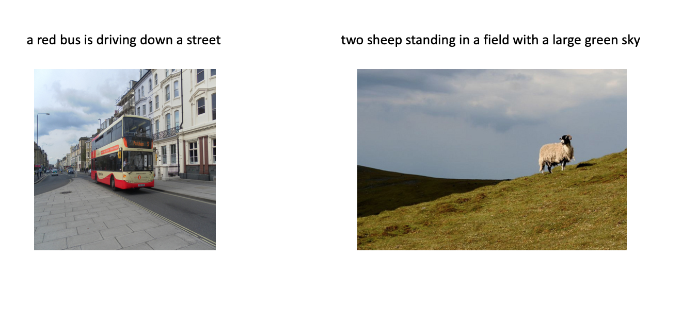

### ImageCaptions
A base model for image captioning

### Config
- python 2.7
- tensorflow 1.8.0
- python package 
    * nltk
    * PIL
    * json
    * numpy

It is all of common tookits, so I don't give their links.

### DataDownload
- coco image dataset
    * you need to download [train2017.zip](http://images.cocodataset.org/zips/train2017.zip)
    * then unzip it to dir 'data/train2017/'
- coco image annotations
    * you need to download [annotations_trainval2017.zip](http://images.cocodataset.org/annotations/annotations_trainval2017.zip)
    * then unzip it:
        * copy 'captions_train2017.json' to dir 'data/coco_annotations'
- pretrain inception model
    * you need to download [inception_v3.ckpt](http://download.tensorflow.org/models/inception_v3_2016_08_28.tar.gz
) to dir 'data/inception/'

## Train
#### First, get post proccess data
- get 'data/captions.json', 'data/captions_gt.json'
    ```shell
    $ cd preproccess
    $ python data_entry.py    
    ```
- get 'data/image_id_train.json', 'data/image_id_val.json', 'data/image_id_test.json'
    ```shell
    $ cd preproccess
    $ python image_id_split.py    
    ```
- get 'data/vocabulary.json'
    ```shell
    $ cd preproccess
    $ python vocabulary.py    
    ```
#### Second, get TFRecord files
Because dataset is too large, we should do some operations to purse speed and CPU|GPU efficiency.
You need to wait 30 mins to convert data to 'data/tfrecord/train-xx.tfrecord', I convert Train Data to 40 tfrecord files.
* get 'data/tfrecord/train-00.tfrecord' - 'data/tfrecord/train-39.tfrecord'
    ```shell
    $ python datasets.py    
    ```
* so you need get 'data/tfrecord_name_train.json' for tensorflow filename queue, it is easy
* the val dataset and test data is the same.
    
#### Third, let's go train
```shell
    $ python main.py    
```

## Experiments
Train/Val/Test Dataset, 82783/5000/5000, vocabulary size = 14643 and we not filter out word. We use greedy search not beam search.
#### CNN+RNN
|  | BLEU_1 | BLEU_2 | BLEU_3 | BLEU_4 | METEOR | ROUGE | CIDEr |
| :---: | :---: | :---: | :---: | :---: | :---: | :---: | :---: |
| Train Dataset | 0.7051 | 0.5322 | 0.3832 | 0.2682 | 0.2283 | 0.5128 | 0.7968 |
| Val Dataset | 0.6667 | 0.4866 | 0.3405 | 0.2337 | 0.2096 | 0.4831 | 0.7024 |
| Test Dataset | 0.6687 | 0.4879 | 0.3421 | 0.2364 | 0.2096 | 0.4838 | 0.6972 |
| Paper | 0.666 | 0.461 | 0.329 | 0.246 | - | - | - |

e.g. Show and Tell: A Neural Image Caption Generator, CVPR 2015([pdf](https://arxiv.org/pdf/1411.4555.pdf))

#### CNN+RNN+Soft-Attention
|  | BLEU_1 | BLEU_2 | BLEU_3 | BLEU_4 | METEOR | ROUGE | CIDEr |
| :---: | :---: | :---: | :---: | :---: | :---: | :---: | :---: |
| Val Dataset | 0.6467 | 0.4615 | 0.3180 | 0.2177 | 0.2014 | 0.4684 | 0.6310 |
| Test Dataset | 0.6482 | 0.4638 | 0.3210 | 0.2217 | 0.2013 | 0.4633 | 0.6245 |
| Paper | 0.707 | 0.492 | 0.344 | 0.243 | 0.2390 | - | - |

e.g. Show, Attend and Tell: Neural Image Caption Generation with Visual Attention, ICML([pdf](https://arxiv.org/pdf/1502.03044.pdf))
## Example


## Summary
The model is very very*N simple, I never adjust the hyperparameter, so if you want, you could do.

## References
- [Tensorflow Model released im2text](https://github.com/tensorflow/models/tree/master/research/im2txt)
- [An Implementation in Tensorflow of Guoming Wang](https://github.com/DeepRNN/image_captioning)
- [MS COCO Caption Evaluation Tookit](https://github.com/tylin/coco-caption)
- Vinyals, Oriol, et al. "Show and tell: A neural image caption generator." Proceedings of the IEEE conference on computer vision and pattern recognition. 2015.
- Xu, Kelvin, et al. "Show, attend and tell: Neural image caption generation with visual attention." International conference on machine learning. 2015.
